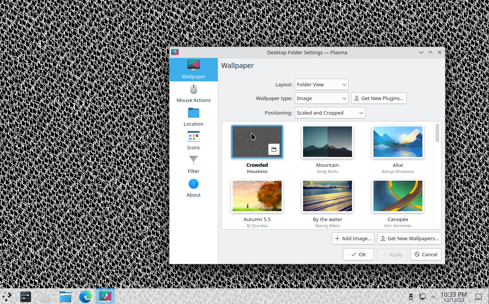
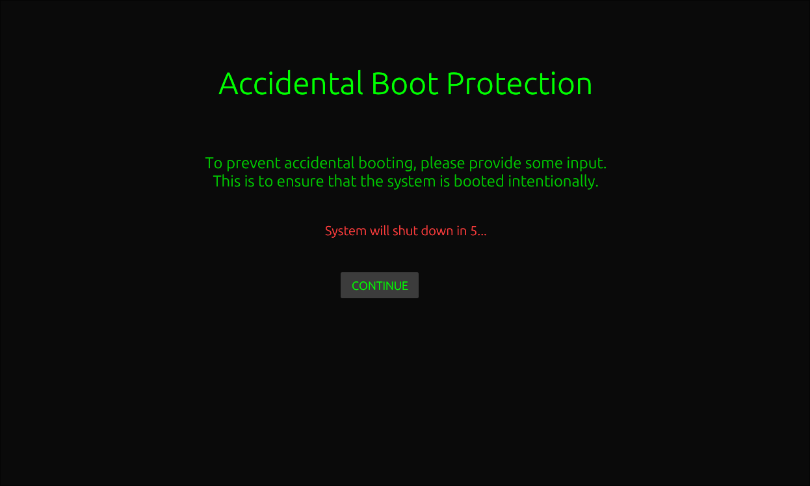
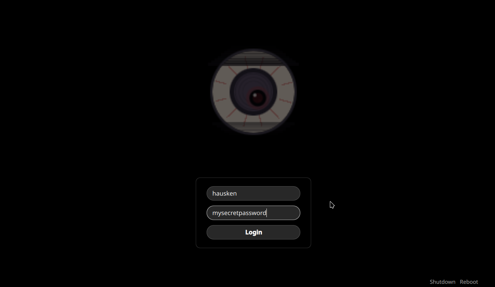
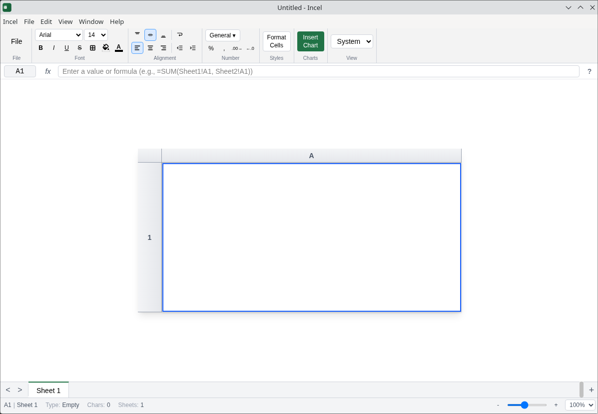
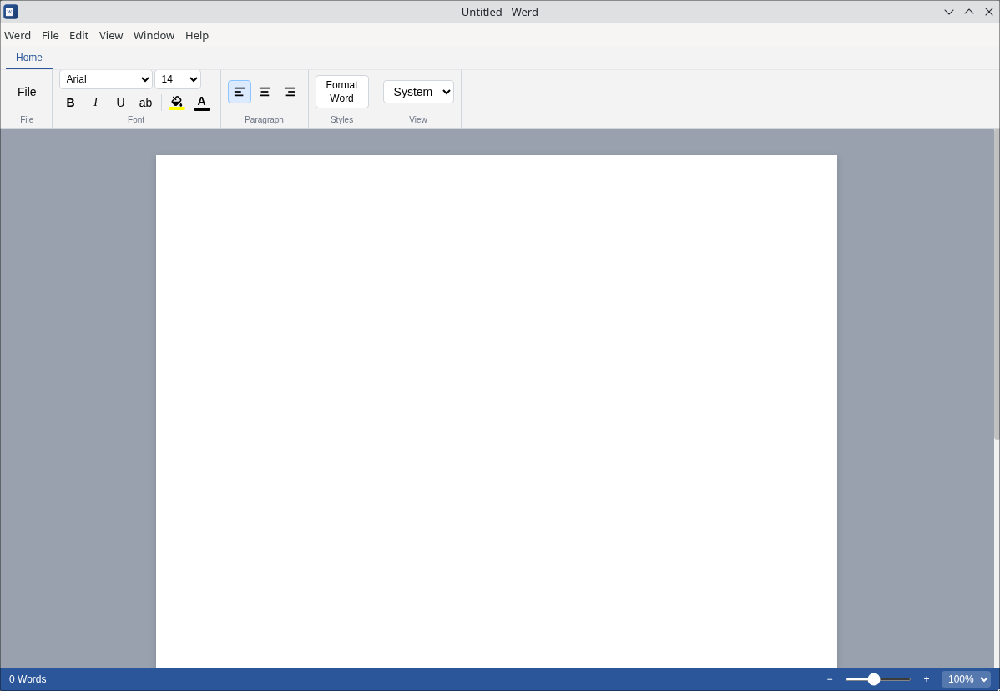
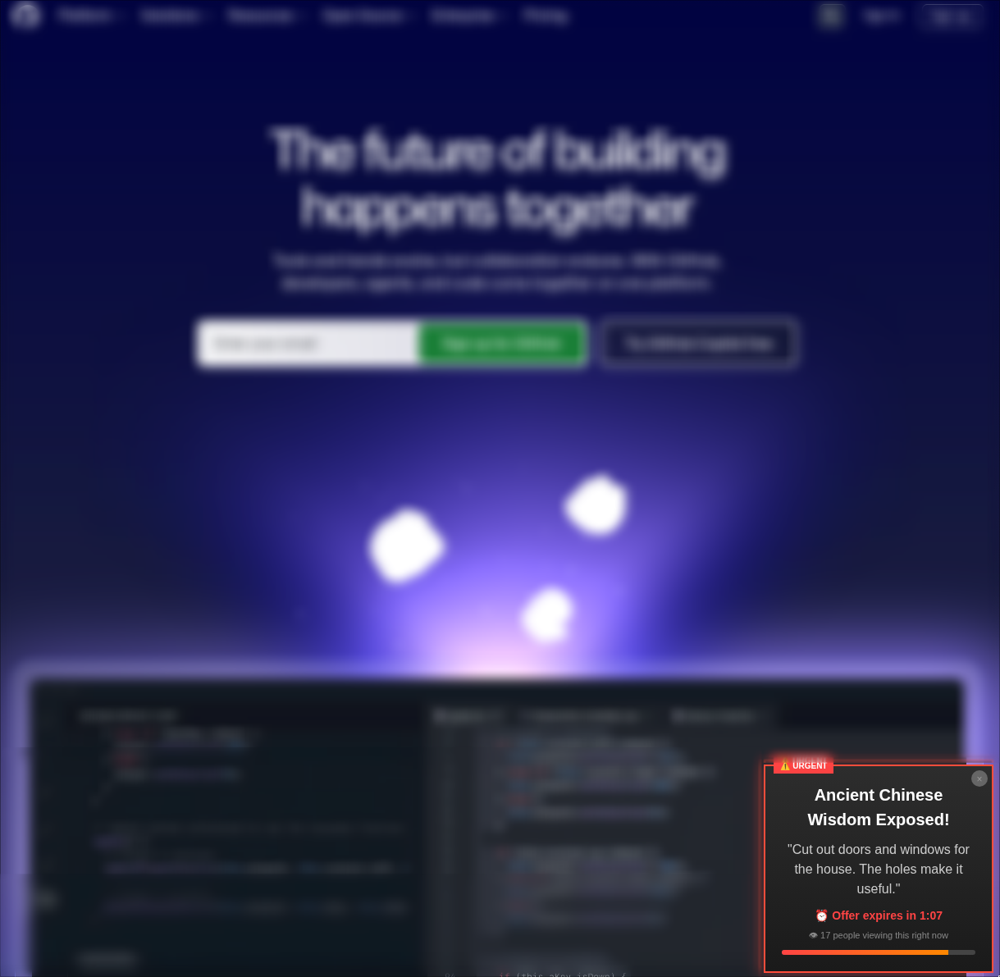
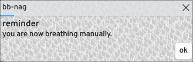
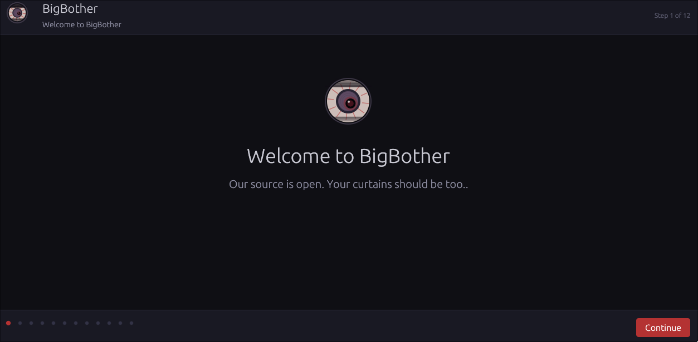
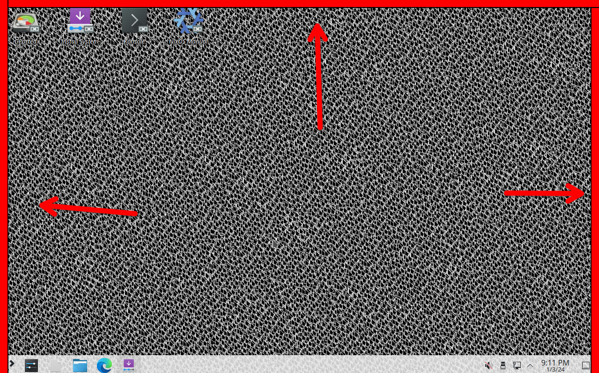

# BigBother

## An annoying, yet functional linux distribution

The goal of this distribution is to push the limits of an annoying user experience, while still remaining fully functional.

It is based on NixOS using flakes and comes with features you would normally not find in other distributions, such as having **Microsoft Edge** as default browser and genuinely inconvenient features.

## Why use this distro?

The simple answer is: **Don't.**

If you are still not conviced, here are some of the features in this distro:

- Microsoft Edge as default browser
- [Custom installer](#custom-installer) for a unique installation experience
- [Accidental boot protection](#accidental-boot-protection)
- [Incel](https://github.com/kluzzebass/incel) and [Werd](https://github.com/kluzzebass/werd) preinstalled
- [Adboost extension](https://github.com/surprisetalk/AdBoost) preloaded in Microsoft Edge
- Default system font [only supports lowercase letters](#other-minor-features)
- Cursor will [slowly drift](#cursor-drift) in a direction
- [Login screen](#customizations-to-the-login-screen) configured to not remember username

## Full Feature List

⚠️ Trigger warning ⚠️

### Wallpaper

Wallpaper named "Crowded" is included, it scales to most screen resolutions, so the cursor background should be the same size as the user's cursor regardless of the user's screen size.



### Accidental boot protection

This is a custom menu entry in the boot menu that will be default unless something else is chosen.

Failing to choose something else within 5 sec it will automatically shut down the system.

A cognitive test and a mandatory breathing exercise is also included to ensure you are a concious and willing participant in using the system.



### The login screen

The login screen SDDM theme is customized:

- Will never remember your username
- Passwords are obviously not something you should hide from someone
- A watchful eye is will ensure you dont hide anything



### Cursor drift

We simulate a slight drift in the mouse cursor to make it feel like the good old days using a TrackPoint.


### "Productivity tools"

We have some great additions for "productivity" bundled with the system. Not that we think you would do anything useful anyways..

#### Incel

Incel is a spreadsheet application with **exactly one** cell per sheet.

You can read more about the project [here](https://github.com/kluzzebass/incel).



#### Werd

Werd is a word processor that allows **exactly one** word.
You can read more about the project [here](https://github.com/kluzzebass/werd).



#### Adboost

Adboost is a browser extension oposite to what an adblocker would do, it adds ads to websites.
You can read more about the project [here](https://github.com/surprisetalk/AdBoost).



### Notifications

A notification service will pull up inspirational system messages.



### Custom Installer

A custom installer is made for this distro with some quite unique options to ensure we only have willing and loyal users.



### Other minor features

- The system's default font has all capital letters replaced with lowercase letters (i.e `A = a`).
- Sometimes prevents space key from being used, ensuring your text has that cozy, compact feel.
- `nano` is an alias to `vim`
- `sudo` is configured to insult you when password is incorrect
- The default cursor is modified to have the click spot on bottom right corner  instead of top left 

### VM mouse containment

Putting cursor at the edges of the screen will lock the computer, this is especially usefull for people running this inside a virtual machine when they move the cursor outside of the virtual machine.
These edges will trigger lock screen:



## Release cycle

This distro is designed to not be upgradable, it is a one time install experience, which is why it follows the Anchorded release model.

## Getting started

**⚠️INSTALL AT YOUR OWN RISK⚠️**

You should preferably run this in a virtual machine, not on physical hardware.
Some of the implementations have too much permissions and is considered to be insecure.

Check the [github releases](https://github.com/BigBotherLinux/BigBother/releases) for the latest ISO.

Its also possible to build the iso yourself with nix:
`nix build .#nixosConfigurations.bb-iso.config.system.build.isoImage`

### Running the ISO in QEMU

If you have Nix installed:

```bash
nix develop
testBB-uefi -iso
# When installation is complete, simply boot without the -iso flag
testBB-uefi
```

Without Nix, you can use QEMU directly:

```bash
# Create a virtual disk
qemu-img create -f qcow2 test-disk.qcow2 20G

# Boot the ISO (UEFI)
qemu-system-x86_64 \
  -enable-kvm \
  -m 4G \
  -smp 2 \
  -bios /usr/share/OVMF/OVMF_CODE.fd \
  -vga virtio \
  -display gtk \
  -usb \
  -device usb-tablet \
  -device virtio-keyboard-pci \
  -drive file=bigbother.iso,media=cdrom,readonly=on,if=none,id=cdrom \
  -device ide-cd,drive=cdrom,bootindex=0 \
  -drive file=test-disk.qcow2,format=qcow2,if=none,id=hdd \
  -device virtio-blk-pci,drive=hdd,bootindex=1
```

> The OVMF path may vary by your choice of inferior distro, i'm sure you'll figure it out!

### Running the ISO in Hyper-V

If you for some strange reason still use Windows, you can run the ISO in Hyper-V, but make sure you:

- Create a Generation 2 VM
- Disable Secure Boot

### Need help?

There is nothing wrong in seeking help, however i doubt you will find it here.

## Found something useful?

If you have any ideas of how the user experience can deteriorate, check out the [contributing guidelines](CONTRIBUTING.md), feel free to create feature requests or bug reports.

## Special thanks

- Instagram @jfb_fit for making the logo
- [SnowflakeOS](https://github.com/snowflakelinux/) for inspiration and versioning implementation
- [Arc KDE theme](https://github.com/PapirusDevelopmentTeam/arc-kde) for inspiration on global theme implementation
- ChatGPT/Claude for providing slop
