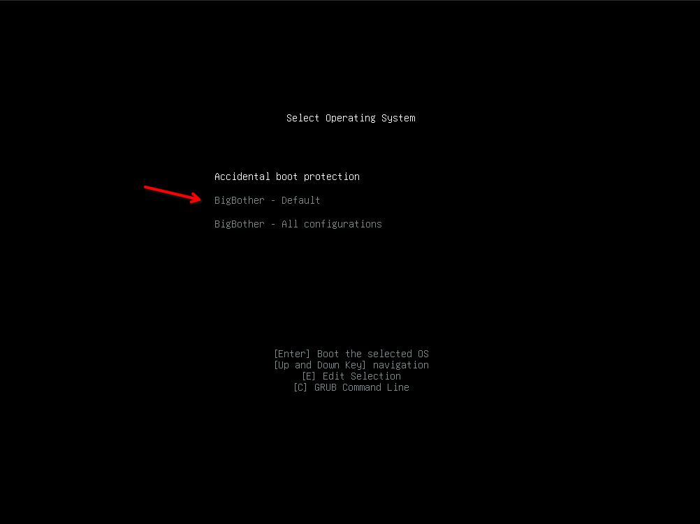
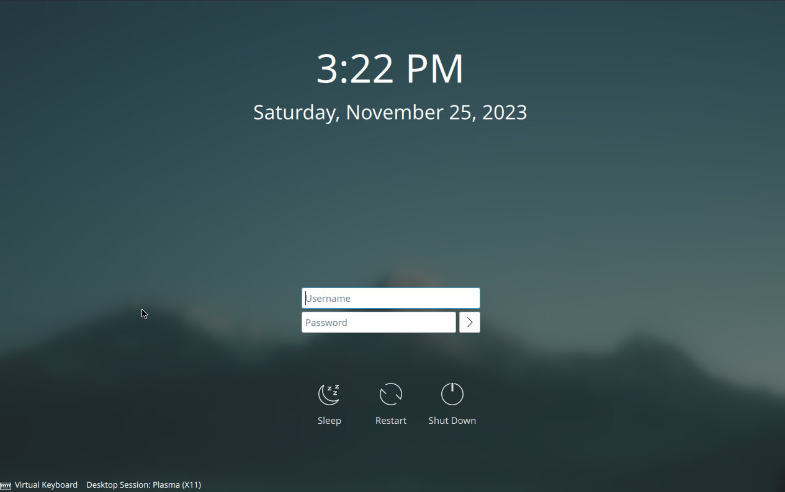

# BigBother
## An annoying, yet functional linux distribution

**Just a hobby project**

The goal of this distribution is to push the limits of an annoying user experience, while still remaining fully functional.

It is based on NixOS using flakes and comes with features you would normally not find in other distributions, such as having **Microsoft Edge** as default browser and a genuinely inconvenient features.

Anything annoying is likely intended (except how slow edge is at first time startup lol). 

## Why use this distro?

The simple answer is: **Don't.**

If you are still not conviced, here are some of the features in this distro:

- Microsoft Edge as default browser
- Nano is aliased to VIM
- System font [only supports lowercase letters](#system-font)
- The cursor's active click point has been [shifted](#cursor)
- Cursor will [slowly drift](#trackpoint-drift-simulation) in a direction
- [Accidental boot protection](#accidental-boot-protection)
- Steep learning curve if you want install or update the system
- Telemetry enabled by default
- [Login screen](#customizations-to-the-login-screen) configured to not remember username
- Sudo is customized to insult you on incorrect password attempts

Much more in depth details about the features are found [here](#features)

## Getting started
**⚠️INSTALL AT YOUR OWN RISK⚠️**

You should preferably run this in a virtual machine, not on physical hardware. 
Some of the implementations have too much permissions and is considered to be insecure.

### Get the ISO

Check the [github releases](https://github.com/BigBotherLinux/BigBother/releases) for torrent file which will include the latest ISO.

You can [build from source](#building-from-source) with nix if you are interested, as builds are reproducable.

### Running iso on Hyper-V
There are some settings you need to change to be able to run this in Hyper-V on Windows, otherwise the [installer will not start](#installer-not-starting)

- When creating virtual machine, **Generation 1** is preferred
- If running **Generation 2** virtual machine, you need to disable secure boot
- Right after starting the iso you will be prompted with some options, **select the 2nd option (nomodeset)**

### Running the iso on QEMU

If you for some weird reason don't use Nix, simply run the quoted commands instead of using `nix-shell -p qemu --command`. 
Modify these commands if you want different memory/cpu setup, you're a grown up, im sure you'll figure it out.

#### Create virtual disk
```bash
nix-shell -p qemu --command "qemu-img create test.qcow2 -f qcow2 40G"
```
#### BIOS - Preferred
Start virtual machine (with iso):
```bash
nix-shell -p qemu --command "qemu-system-x86_64 -enable-kvm -m 6000 -cdrom ISO-IMAGE-HERE.iso -hda test.qcow2 -boot d -smp 4"
```


After installation, shut down the machine and start it without the iso mounted:
```bash
nix-shell -p qemu --command "qemu-system-x86_64 -enable-kvm -m 6000 -hda test.qcow2 -boot d -smp 4"
```

#### UEFI

Non-Nix users need to find out a way to link to their own EFI files here, glhf.

Start virtual machine (with iso):
```bash
nix-shell -p qemu --command "qemu-system-x86_64 -bios $(nix build --print-out-paths --no-link nixpkgs#OVMF.fd)/FV/OVMF.fd -enable-kvm -m 6000 -cdrom ISO-IMAGE-HERE.iso -hda test.qcow2 -boot d -smp 4"
```


After installation, shut down the machine and start it without the iso mounted:
```bash
nix-shell -p qemu --command "qemu-system-x86_64 -bios $(nix build --print-out-paths --no-link nixpkgs#OVMF.fd)/FV/OVMF.fd -enable-kvm -m 6000 -hda test.qcow2 -boot d -smp 4"
```


### Need help?

There is nothing wrong in seeking help, however i doubt you will find it here.

#### Installer not starting

If you get logged into a screen like this, try the second boot option (nomodeset)


## Features 
⚠️ Trigger warning ⚠️ 

### Customized installer
The ISO contains a customized and branded installer which is a [fork of this calamares extension](https://github.com/NixOS/calamares-nixos-extensions)


### Accidental boot protection
This is a custom menu entry in the boot menu that will be default unless something else is chosen.
Failing to choose something else within 5 sec it will automatically shut down the system.

Select this option to boot the system, otherwise a unintended boot is prevented.


### Safe space
Sometimes prevents space key from being used, ensuring your text has that cozy, compact feel.

### Desktop theme service
This distro comes with a preferred theme, therefore a service is created to ensure **correct** theme is used on startup.

### System font
[Underpass](https://github.com/BigBotherLinux/Underpass) is the system's default font and is forked off [Overpass](https://github.com/BigBotherLinux/Underpass).

In this font, all capital letters are replaced with lowercase letters (i.e `A = a`).

### Cursor
The default cursor named "Gust" is a fork of the KDE cursor "Breeze". It is modified to have the cursor click spot on bottom right corner instead of top left. 

Old: 


New: 


### TrackPoint drift simulation
*TrackPoint drift simulation* gently nudges your cursor in one direction to simulate the nostalgic experience of having the TrackPoint mice stuck between one of the keys. 

### Wallpaper
Wallpaper named "Crowded" is included, it scales to most screen resolutions, so the cursor background should be the same size as the user's cursor regardless of the user's screen size.


### VM mouse containment
Putting cursor at the edges of the screen will lock the computer, this is especially usefull for people running this inside a virtual machine when they move the cursor outside of the virtual machine.
These edges will trigger lock screen:


### Customizations to the login screen
The login screen (SDDM) is customized to never remember the username, so the user will have to type both the username and password to log in. 



### Other customizations
- `nano` is an alias to `vim`
- `sudo` is configured to insult you when password is incorrect


## Found something useful?  
If you have any ideas of how the user experience can deteriorate, please create [issues](https://github.com/BigBotherLinux/BigBother/issues) in the project repo. 

Contributions are also welcome with these guidelines:

- System has to be usable
- User should not be required to do anything other than go through the installer.
- ISO and system has to be reprodusable
- Features should not cause data loss or be destructive
- It should **not** spark joy


[feelafraidcomic.com](https://feelafraidcomic.com/60.php) - [@feel_afraid](https://twitter.com/feel_afraid)

## Feature wishlist
This is a list of features not yet implemented. 
- Add system font with only lower-case letters
- "Start" button icon
- Find out a way to set up a theme(the nix way).
- Create a welcome-screen
- New calamares module
- Set up a script or a alias for updating or installing packages. User will have to dig into the nix config themselves, but at least they could get some pointers on where to begin.
- Go over licenses to ensure all is ok

## Building from source
The entire build is done with **nix**, build has only been tested from a NixOS machine, but should probably work fine with other nix-shell environments.

Make sure you have [flakes enabled](https://nixos.wiki/wiki/Flakes)

To build:

```bash
nix build .\#nixosConfigurations.bigbotherinstaller.config.formats.isogen
``` 

There will be a symlink `result` in the root folder where you ran the command which is a link to the generated iso.

## Distributing iso with torrent

This will build the iso and create a torrent file. 

Copy the `result` folder somewhere, to start seeding make sure to select the download folder above the folder you copied.

```bash
nix build .#packages.x86_64-linux.makeTorrent
```

## About this project
This project has been a personal learning experience, and should not be taken seriously. It started with a ansible project that bootstrapped debian with customizations, but this had lots of issues and was slow to troubleshoot. It was also not reprodusable...

After taking the [Nix pills](https://nixos.org/guides/nix-pills/) i got motivated to rewrite this project as a distro based on NixOS. Rebuilding the ISO has been so much easier now and i can feel pretty confident that if the iso boots the user will also be able to install it with the same configurations since the flake.lock is injected into the generated iso.


## Special thanks

- Instagram @jfb_fit for making the logo
- [SnowflakeOS](https://github.com/snowflakelinux/) for inspiration and versioning implementation
- [calamares nixos extension](https://github.com/NixOS/calamares-nixos-extensions) for fork and inspiration
- [Arc KDE theme](https://github.com/PapirusDevelopmentTeam/arc-kde) for inspiration on global theme implementation
- ChatGPT for being a great companion when troubleshooting and developing this.
