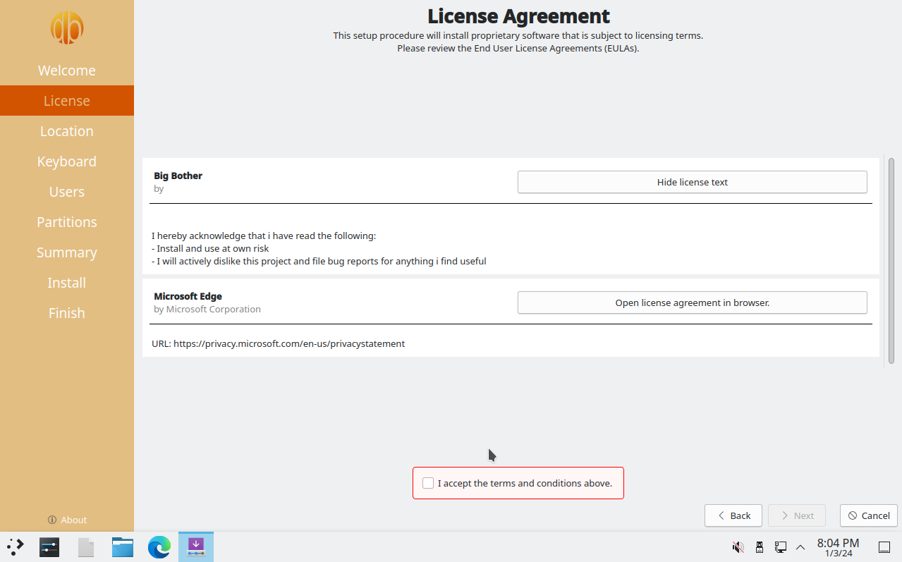

# BigBother
## An annoying, yet functional linux distribution

The goal of this distribution is to push the limits of an annoying user experience, while still remaining fully functional.

It is based on NixOS using flakes and comes with features you would normally not find in other distributions, such as having **Microsoft Edge** as default browser and **Telemetry enabled** by default wherever possible.

Anything annoying is likely intended (except how slow edge is at first time startup lol). 

## Why use this distro?

The simple answer is: **Don't.**

If you are still not conviced, here are some of the features in this distro:

- Microsoft Edge as default browser
- Accidental boot protection
- Steep learning curve if you want install or update the system
- Telemetry enabled by default
- No user bias in login screen
- Nano is aliased to VIM
- Sudo is customized to insult you on incorrect password attempts

More in depth details about the features are found [here](#features)

## Getting started
**⚠️INSTALL AT YOUR OWN RISK⚠️**

**Torrent not available yet**

~~Check the [github releases](https://github.com/BigBotherLinux/BigBother/releases) for torrent file which will include the ISO. Boot up the ISO, preferably in an Virtual Machine.~~

You can [build from source](#building-from-source) with nix if you are interested.

## Need help?

There is nothing wrong in seeking help, however i doubt you will find it here.

## Features 
### Customized installer
The ISO contains a customized and branded installer which is a [fork of this calamares extension](https://github.com/NixOS/calamares-nixos-extensions)



### Accidental boot protection
This is a custom menu entry in the boot menu that will be default unless something else is chosen.
Failing to choose something else within 5 sec it will automatically shut down the system.

Select this option to boot the system

 Otherwise a unintended boot is prevented.
### Customizations to the login screen
The login screen (SDDM) is customized to never remember the username, so the user will have to type both the username and password to log in. 


### Desktop Environment tweaks
- ~~KDE Telemetry is enabled~~
- ~~Volume slider is in increments of 3. This part only works when using a volume knob or media keys.~~
- ~~Double clicking on the top bar will minimize the window instead of maximizing it.~~
- ~~Animation speed is increased, which will allow the user time to think before their next action.~~

### Other customizations
- `nano` is an alias to `vim`
- `sudo` is configured to insult you when password is incorrect


## Found something useful?  
If you have any ideas of how the user experience can deteriorate, please create [issues](https://github.com/BigBotherLinux/BigBother/issues) in the project repo. 

Contributions are also welcome with these guidelines:

- System has to be usable
- User should not be required to do anything other than go through the installer.
- ISO and system has to be reprodusable
- Features should not cause data loss or be destructive
- It should **not** spark joy


[feelafraidcomic.com](https://feelafraidcomic.com/60.php) - [@feel_afraid](https://twitter.com/feel_afraid)

## Feature wishlist
This is a list of features not yet implemented. 
- A cursor theme, where the pointer is not alligned with the textature.


### TODO

- Set up a script or a alias for updating or installing packages. User will have to dig into the nix config themselves, but at least they could get some pointers on where to begin.
- Find out a way to set up a theme(the nix way).


## Building from source
The entire build is done with **nix**, build has only been tested from a NixOS machine, but should probably work fine with other nix-shell environments.

Make sure you have [flakes enabled](https://nixos.wiki/wiki/Flakes)

To build:

```bash
nix build .\#nixosConfigurations.bigbotherinstaller.config.formats.isogen
``` 

There will be a symlink `result` in the root folder where you ran the command which is a link to the generated iso.

## Testing the image with QEMU

Create virtual disk:
```bash
nix-shell -p qemu --command "qemu-img create test.qcow2 -f qcow2 40G"
```

Start virtual machine (with iso):
```bash
nix-shell -p qemu --command "qemu-system-x86_64 -enable-kvm -m 8000 -cdrom result -hda test.qcow2 -boot d -smp 4"
```


After installation, shut down the machine and start it without the iso mounted:
```bash
nix-shell -p qemu --command "qemu-system-x86_64 -enable-kvm -m 8000 -hda test.qcow2 -boot d -smp 4"
```

## About this project
This project has been a personal learning experience, and should not be taken seriously. It started with a ansible project that bootstrapped debian with customizations, but this had lots of issues and was slow to troubleshoot. It was also not reprodusable...

After taking the [Nix pills](https://nixos.org/guides/nix-pills/) i got motivated to rewrite this project as a distro based on NixOS. Rebuilding the ISO has been so much easier now and i can feel pretty confident that if the iso boots the user will also be able to install it with the same configurations since the flake.lock is injected into the generated iso.

